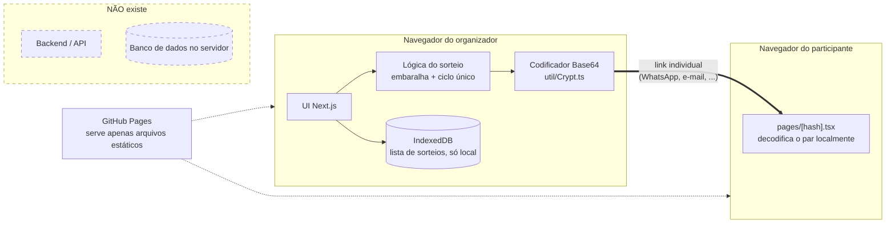
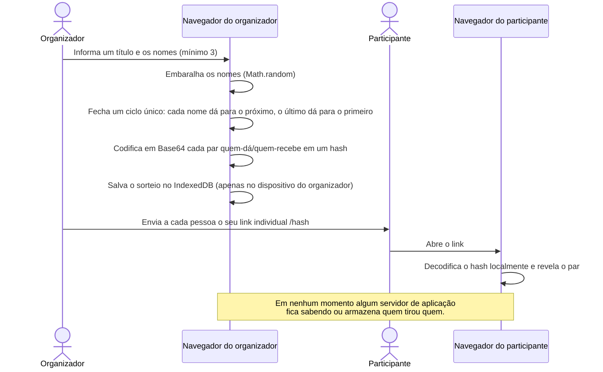
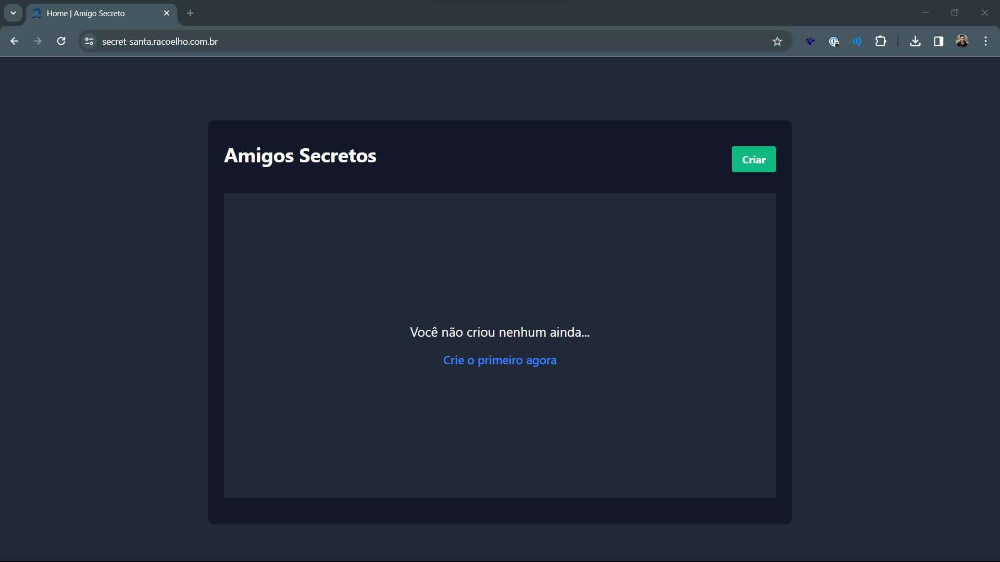
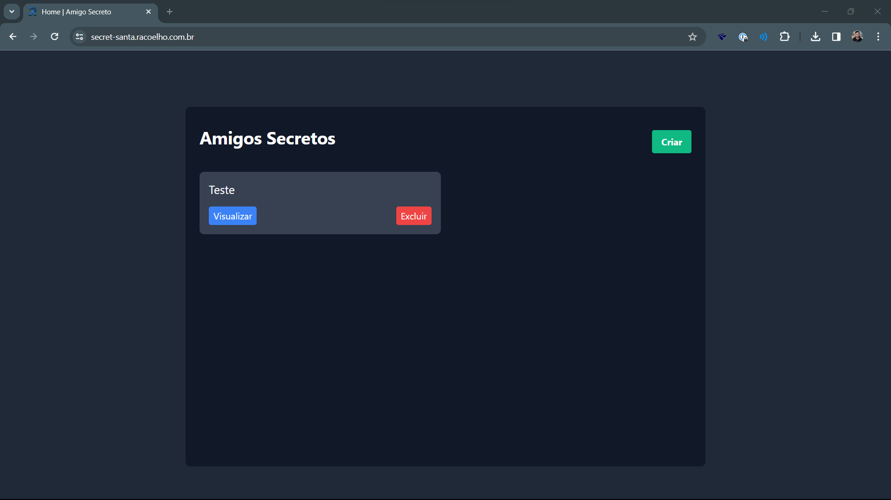
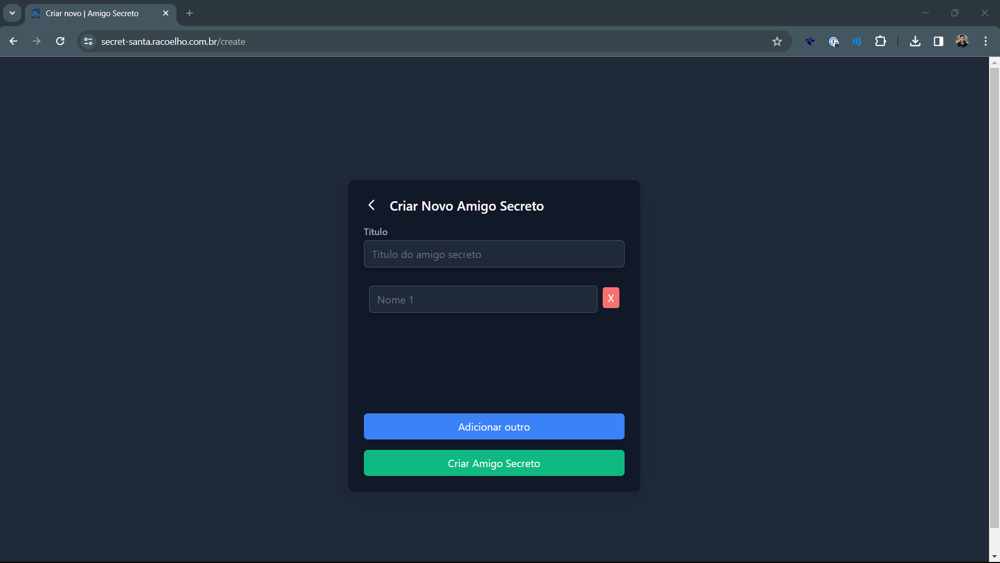
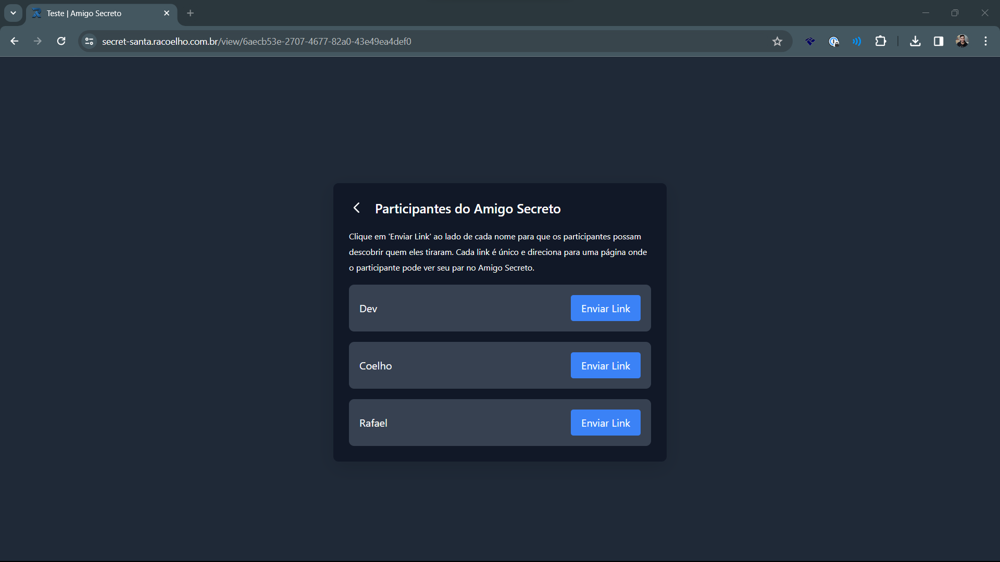
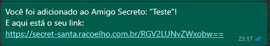
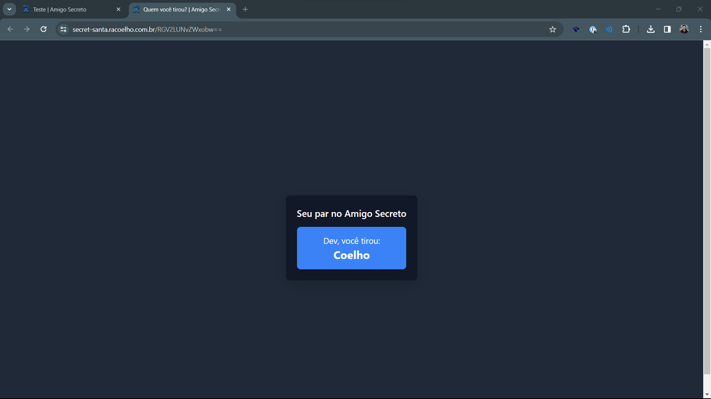

<h1 align="center">Amigo Secreto</h1>

<p align="center">Um amigo secreto serverless: o sorteio roda no seu navegador e o par de cada participante viaja dentro do próprio link. Sem backend. Sem banco de dados. Nada além de arquivos estáticos.</p>

<p align="center">

[🇧🇷 Português](./LEIAME.md) | [🇺🇸 English](./README.md)

</p>

<p align="center">
  
  
  
</p>

<p align="center"><strong>Ao vivo:</strong> <a href="https://secret-santa.racoelho.com.br">secret-santa.racoelho.com.br</a></p>

## Sobre

Todo app de amigo secreto tem o mesmo requisito incômodo: em algum lugar, um servidor precisa lembrar quem tirou quem. Este aqui não.

O truque: **o resultado do sorteio é codificado dentro do próprio link.** Quando o organizador cria um sorteio, o app embaralha os nomes no navegador, forma os pares e codifica em Base64 cada par `quem-dá → quem-recebe` em uma URL como:

```
https://secret-santa.racoelho.com.br/<par-codificado>
```

O organizador envia a cada pessoa o seu link individual. Quando o participante abre, a página (`pages/[hash].tsx`) decodifica o par ali mesmo, no navegador dele, e mostra quem ele tirou. O link é autocontido — nunca expira e funciona para sempre, porque não existe estado no servidor que possa se perder.

A única coisa armazenada em qualquer lugar é a lista de sorteios do próprio organizador, guardada localmente no navegador dele via **IndexedDB**, para que possa revisitar e reenviar os links depois.

## Arquitetura

As partes mais importantes deste diagrama são as caixas tracejadas — as coisas que **não existem**:


```mermaid
flowchart LR
    subgraph org["Navegador do organizador"]
        UI["UI Next.js"]
        DRAW["Lógica do sorteio<br/>embaralha + ciclo único"]
        B64["Codificador Base64<br/>util/Crypt.ts"]
        IDB[("IndexedDB<br/>lista de sorteios, só local")]
        UI --> DRAW --> B64
        UI --> IDB
    end

    subgraph part["Navegador do participante"]
        VIEW["pages/[hash].tsx<br/>decodifica o par localmente"]
    end

    PAGES["GitHub Pages<br/>serve apenas arquivos estáticos"]
    PAGES -.-> org
    PAGES -.-> part
    B64 == "link individual<br/>(WhatsApp, e-mail, ...)" ==> VIEW

    subgraph none["NÃO existe"]
        API["Backend / API"]
        DB[("Banco de dados no servidor")]
    end

    style none stroke-dasharray: 6 6
    style API stroke-dasharray: 6 6
    style DB stroke-dasharray: 6 6
```

O fluxo completo, do organizador ao participante:


```mermaid
sequenceDiagram
    actor O as Organizador
    participant OB as Navegador do organizador
    actor P as Participante
    participant PB as Navegador do participante

    O->>OB: Informa um título e os nomes (mínimo 3)
    OB->>OB: Embaralha os nomes (Math.random)
    OB->>OB: Fecha um ciclo único: cada nome dá para o próximo, o último dá para o primeiro
    OB->>OB: Codifica em Base64 cada par quem-dá/quem-recebe em um hash
    OB->>OB: Salva o sorteio no IndexedDB (apenas no dispositivo do organizador)
    O->>P: Envia a cada pessoa o seu link individual /hash
    P->>PB: Abre o link
    PB->>PB: Decodifica o hash localmente e revela o par
    Note over OB,PB: Em nenhum momento algum servidor de aplicação<br/>fica sabendo ou armazena quem tirou quem.
```

### O algoritmo do sorteio

O `pages/create.tsx` embaralha a lista e a encadeia em um **ciclo único fechado**: a pessoa `i` dá presente para a pessoa `i + 1`, e a última dá para a primeira. Por construção, ninguém tira a si mesmo e todo mundo dá e recebe exatamente uma vez. O mínimo de 3 nomes é obrigatório (com 2 pessoas o "sorteio" seria só uma troca mútua).

### Mapa do projeto

```
pages/
  index.tsx       # painel do organizador: lista os sorteios salvos (IndexedDB)
  create.tsx      # criação do sorteio: nomes, embaralhamento, codificação, salvamento
  view/[id].tsx   # links de cada participante com botão de copiar
  [hash].tsx      # página do participante: decodifica o par a partir da URL
util/
  Crypt.ts        # codifica/decodifica pares em Base64 (sem criptografia de verdade — veja os trade-offs)
  IndexedDB.ts    # persistência local da lista de sorteios do organizador
```

## Funcionalidades

- Crie um sorteio com título e 3+ nomes — em segundos, sem cadastro
- Sorteio justo em ciclo único: ninguém tira a si mesmo, todo mundo dá e recebe exatamente um presente
- Um link individual por participante, copiado para a área de transferência com um clique
- Links autocontidos: sem expiração, sem estado no servidor, nada para quebrar
- Painel do organizador para listar, ver e excluir sorteios, salvo localmente no IndexedDB
- Bilíngue (pt-BR / en-US), selecionado automaticamente pelo `Accept-Language` do navegador
- Interface dark construída com Tailwind CSS
- Deploy contínuo no GitHub Pages via GitHub Actions

## Stack

- [Next.js 14](https://nextjs.org/) (Pages Router) + [TypeScript](https://www.typescriptlang.org/)
- [Tailwind CSS](https://tailwindcss.com/)
- [next-i18next](https://github.com/i18next/next-i18next) para pt-BR / en-US
- [IndexedDB](https://developer.mozilla.org/pt-BR/docs/Web/API/IndexedDB_API) para o armazenamento local do organizador
- GitHub Actions → GitHub Pages (`.github/workflows/nextjs.yml`)

## Como executar

Requer Node.js 20+.

```bash
git clone https://github.com/rafa-coelho/amigo-secreto.git
cd amigo-secreto

# instalar as dependências
yarn            # ou: npm install

# rodar o servidor de desenvolvimento em http://localhost:3000
yarn dev        # ou: npm run dev

# build de produção
yarn build      # ou: npm run build
```

Outros scripts: `yarn start` (serve o build de produção) e `yarn lint`.

## Trade-offs honestos

Este projeto faz escolhas deliberadas em favor de **custo zero de infraestrutura**, e é justo deixá-las explícitas:

- **Base64 é codificação, não criptografia.** Qualquer pessoa que decodificar o hash do link (uma linha no console de qualquer navegador) verá os dois nomes do par. Apesar de o arquivo se chamar `Crypt.ts`, não há criptografia nele. É *privacidade por conveniência*: suficiente para proteger o segredo de uma olhada casual, não de um participante determinado.
- **O par viaja na URL.** Quem tiver um link (ou um histórico de conversa contendo o link) pode descobrir aquele par.
- **O dispositivo do organizador sabe tudo.** O sorteio inteiro é gerado e armazenado no navegador do organizador — algo inerente a qualquer ferramenta em que uma pessoa cria o sorteio.
- **IndexedDB é local.** Limpar os dados do site ou trocar de dispositivo apaga o painel do organizador. Os links já enviados continuam funcionando, porém — eles não dependem disso.
- **Embaralhamento com `Math.random()`.** Ótimo para um amigo secreto entre amigos; não é um embaralhamento criptograficamente justo, e a técnica do comparador no `sort()` tem um leve viés.

Se você precisa de sigilo à prova de adversários no amigo secreto da sua família, talvez o problema não seja a ferramenta — mas este não é o app para isso. Para todo o resto, ele roda de graça, para sempre, em hospedagem estática.

## Screenshots

<details>
<summary>Clique para expandir</summary>

### Home



### Criando um sorteio



### Visualizando um sorteio (organizador)


### O link que o participante recebe


### Revelando o par


</details>

---

<p align="center">Feito por <a href="https://github.com/rafa-coelho">rafa-coelho</a></p>
