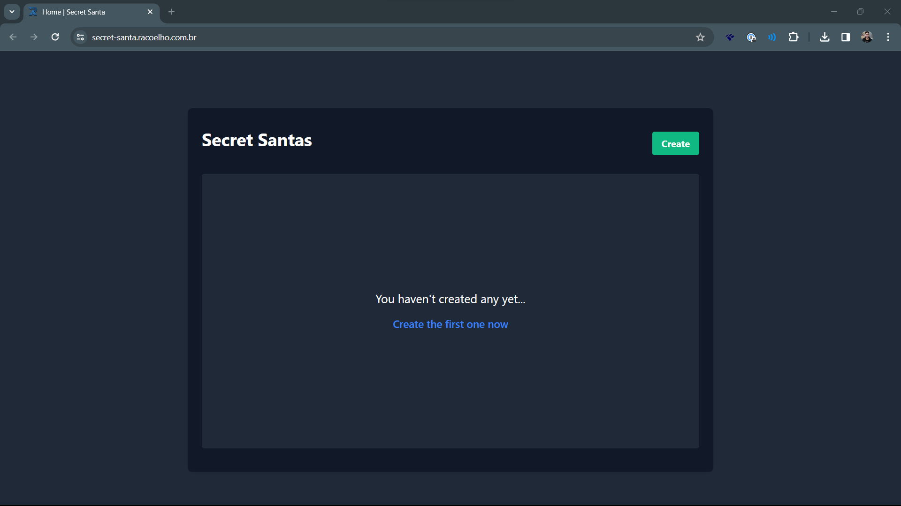
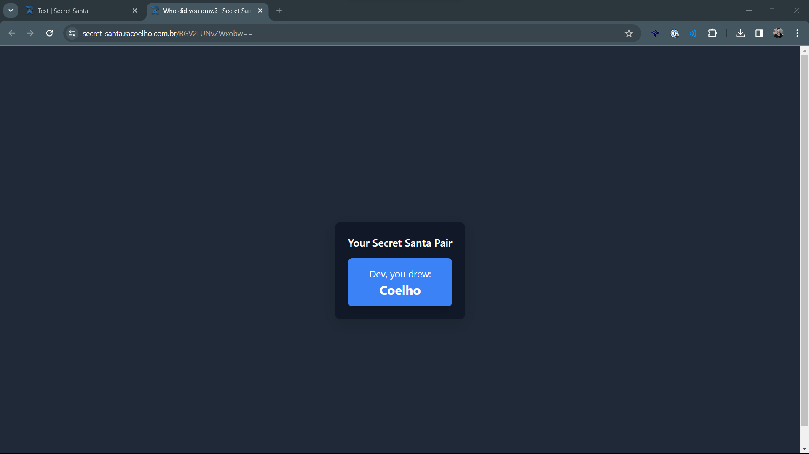

<h1 align="center">Amigo Secreto</h1>

<center>

[Read in English](./README.md)

</center>

<p align="center">
  

  

  

</p>

#### :sparkles: Sobre o projeto
É um criador de "Amigo Secreto"s feito para funcionar sem um banco de dados em servidor.

Ele utiliza o **IndexedDB** do navegador para armazenar as informações localmente para o criador do sorteio.

Ao gerar informar os nomes e criar o Amigo Secreeto, a aplicação sorteia o nome e gera um link para cada participante.

O Link contém um HASH baseado no nome do participante o de seu amigo sorteado. 
Assim, sem a necessidade de salvar a informação, os participantes podem ver quem eles tiraram.

#### :rocket: Tecnologias usadas

- [NodeJS](https://nodejs.org/en)
- [NextJS](https://nextjs.org/)
- [IndexedDB](https://developer.mozilla.org/en-US/docs/Web/API/IndexedDB_API/Using_IndexedDB)

#### Como executar


Para instalar:

```bash
npm install
# or
yarn
```

Para excutar
```bash
npm run dev
# or
yarn dev
```

#### Cadê o demo? 
Tá aqui: [Amigo Secreto](https://amigo-secreto.racoelho.dev/)

<hr />


#### :tv: Screenshots

##### Home



##### Criando Sorteio: 


##### Visualizar:


##### Link gerado:
Ao enviar o link, a mensagem ficará assim:


##### Resultado

