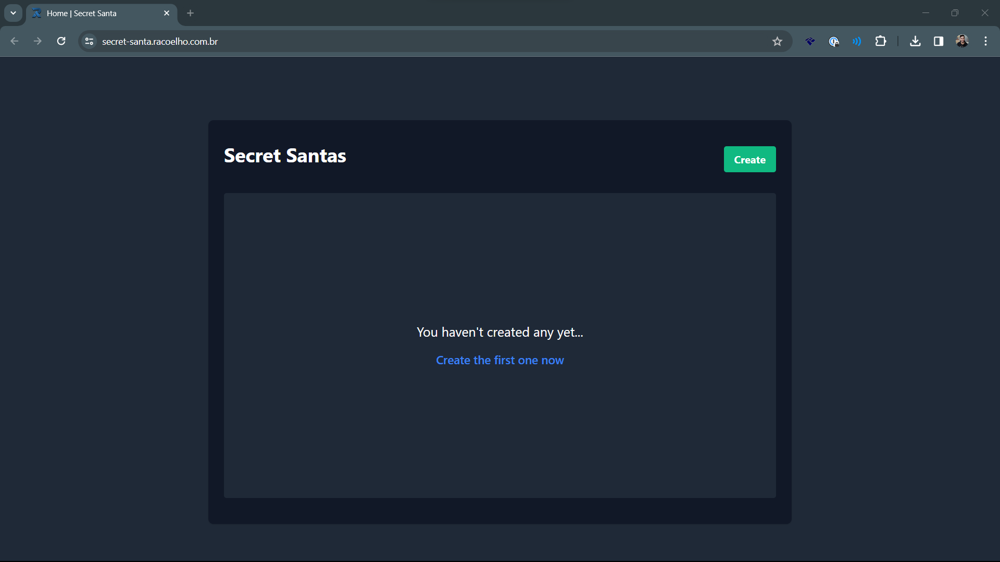
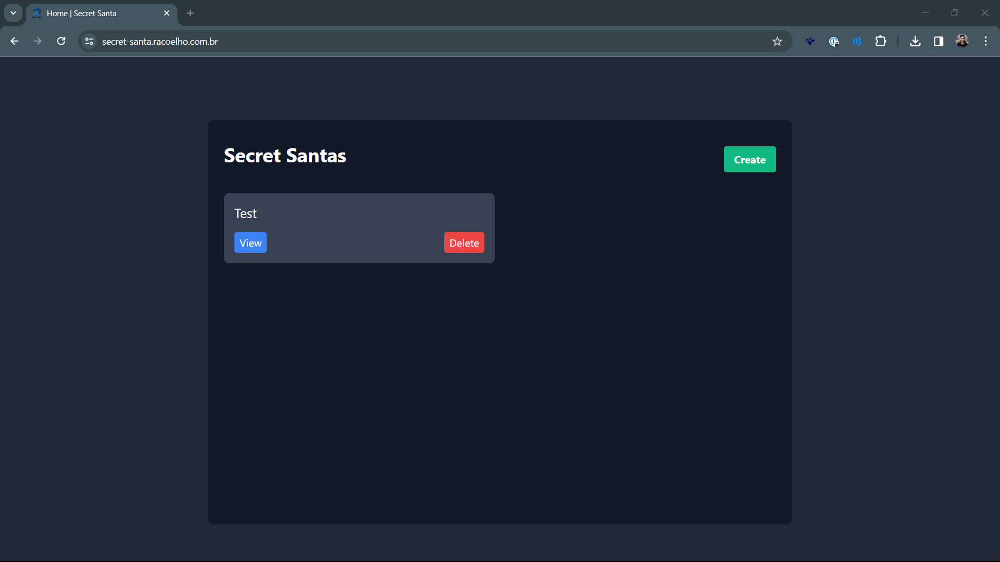
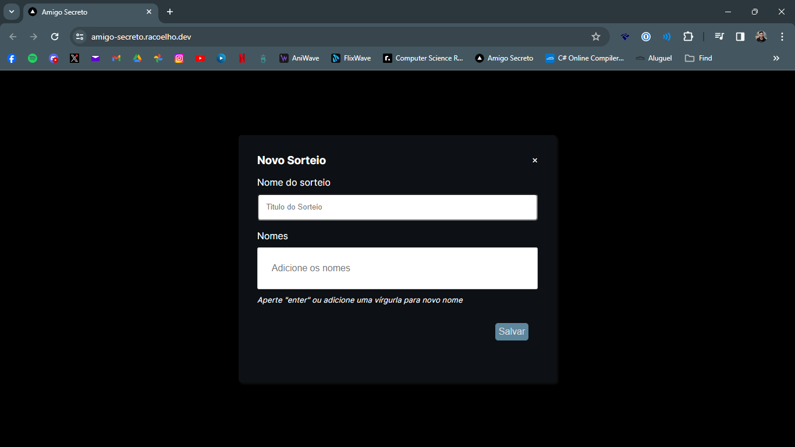
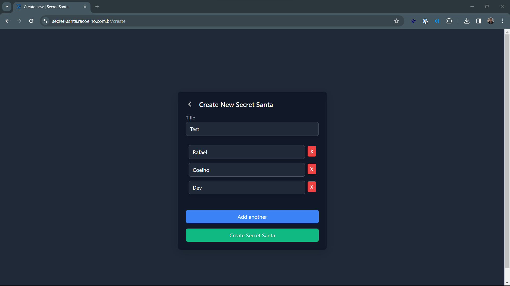
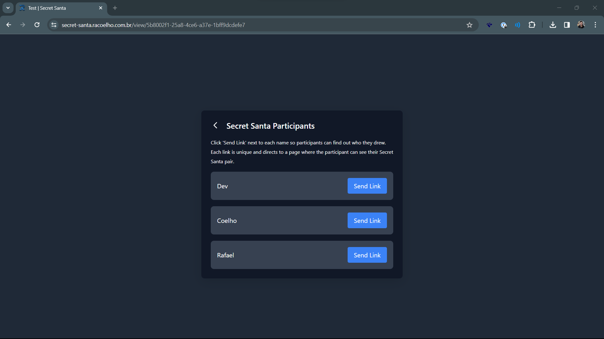
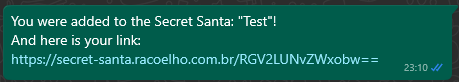
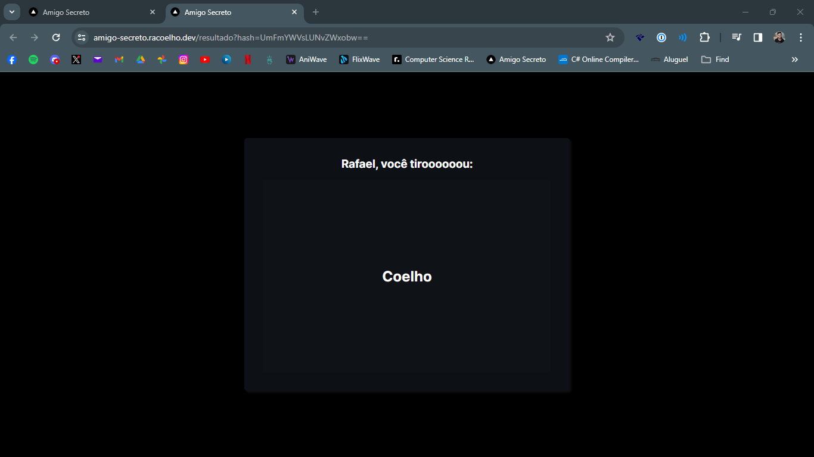

<h1 align="center">Secret Santa</h1>

<center>

[Leia em Portguês](./LEIAME.md)

</center>

<p align="center">
  
  
  
</p>


#### :sparkles: About the project
It's a "Secret Santa" creator designed to work without a server database.

It uses the IndexedDB of the browser to store information locally for the creator of the draw.

When generating, inform the names and create the Secret Santa, the application draws a name and generates a link for each participant.

The link contains a HASH based on the name of the participant and their randomly selected friend.
Thus, without the need to save the information, participants can see who they drew.

#### :rocket: Used Technologies

- [NodeJS](https://nodejs.org/en)
- [NextJS](https://nextjs.org/)
- [IndexedDB](https://developer.mozilla.org/en-US/docs/Web/API/IndexedDB_API/Using_IndexedDB)


#### How to Run

To install:

```bash
npm install
# or
yarn
```

To run:
```bash
npm run dev
# or
yarn dev
```

#### Where's the Demo?
It's here: [Secret Santa](https://amigo-secreto.racoelho.dev/)

<hr />


#### :tv: Screenshots

##### Home



##### Creating Draw: 



##### View:


##### Generated Link:
After send the link, thee message will be like this:


##### Result

