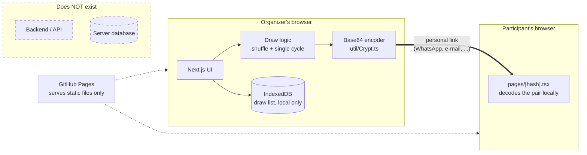
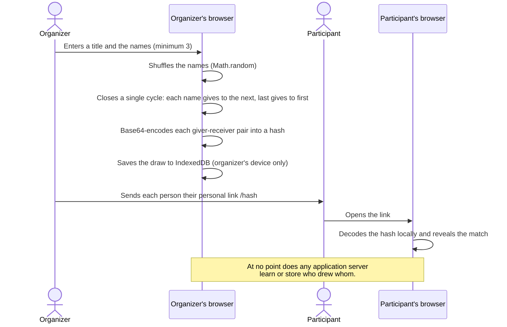
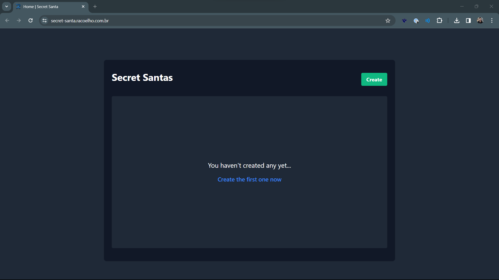
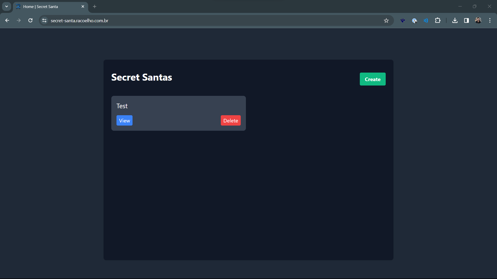
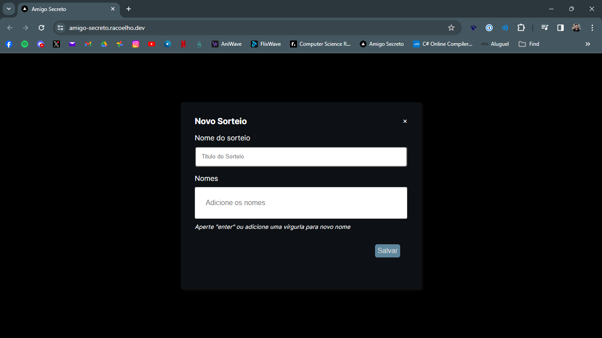
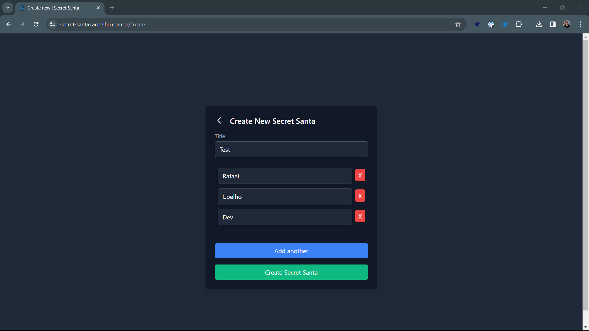
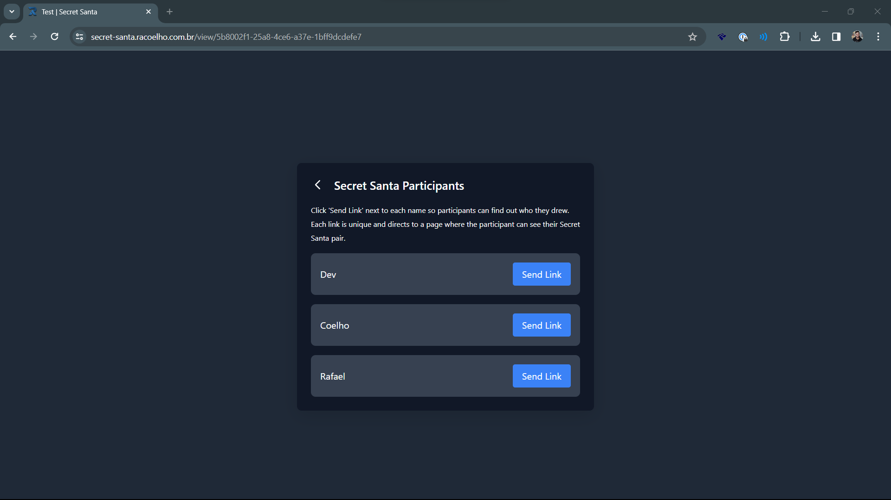
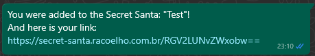
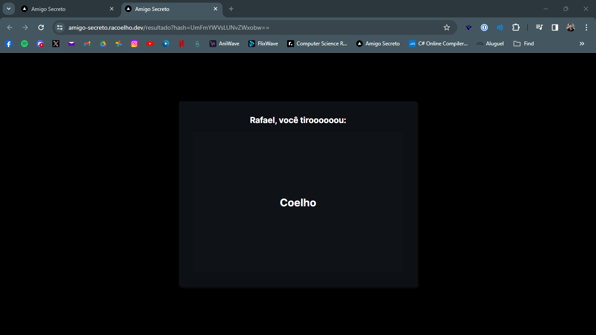

<h1 align="center">Secret Santa</h1>

<p align="center">A serverless Secret Santa: the draw runs in your browser and each participant's match travels inside their own link. No backend. No database. Nothing to deploy but static files.</p>

<p align="center">

[🇧🇷 Português](./LEIAME.md) | [🇺🇸 English](./README.md)

</p>

<p align="center">
  
  
  
</p>

<p align="center"><strong>Live:</strong> <a href="https://secret-santa.racoelho.com.br">secret-santa.racoelho.com.br</a></p>

## About

Every Secret Santa app has the same awkward requirement: somewhere, a server has to remember who drew whom. This one doesn't.

The trick: **the result of the draw is encoded into the link itself.** When the organizer creates a draw, the app shuffles the names in the browser, pairs everyone up, and Base64-encodes each `giver → receiver` pair into a URL like:

```
https://secret-santa.racoelho.com.br/<encoded-pair>
```

The organizer sends each person their personal link. When a participant opens it, the page (`pages/[hash].tsx`) decodes the pair right there in their browser and shows who they drew. The link is self-contained — it never expires and works forever, because there is no server-side state that could be lost.

The only thing stored anywhere is the organizer's own list of draws, kept locally in their browser via **IndexedDB** so they can revisit and re-share links later.

## Architecture

The most important parts of this diagram are the dashed boxes — the things that **do not exist**:


```mermaid
flowchart LR
    subgraph org["Organizer's browser"]
        UI["Next.js UI"]
        DRAW["Draw logic<br/>shuffle + single cycle"]
        B64["Base64 encoder<br/>util/Crypt.ts"]
        IDB[("IndexedDB<br/>draw list, local only")]
        UI --> DRAW --> B64
        UI --> IDB
    end

    subgraph part["Participant's browser"]
        VIEW["pages/[hash].tsx<br/>decodes the pair locally"]
    end

    PAGES["GitHub Pages<br/>serves static files only"]
    PAGES -.-> org
    PAGES -.-> part
    B64 == "personal link<br/>(WhatsApp, e-mail, ...)" ==> VIEW

    subgraph none["Does NOT exist"]
        API["Backend / API"]
        DB[("Server database")]
    end

    style none stroke-dasharray: 6 6
    style API stroke-dasharray: 6 6
    style DB stroke-dasharray: 6 6
```

The full flow, from organizer to participant:


```mermaid
sequenceDiagram
    actor O as Organizer
    participant OB as Organizer's browser
    actor P as Participant
    participant PB as Participant's browser

    O->>OB: Enters a title and the names (minimum 3)
    OB->>OB: Shuffles the names (Math.random)
    OB->>OB: Closes a single cycle: each name gives to the next, last gives to first
    OB->>OB: Base64-encodes each giver-receiver pair into a hash
    OB->>OB: Saves the draw to IndexedDB (organizer's device only)
    O->>P: Sends each person their personal link /hash
    P->>PB: Opens the link
    PB->>PB: Decodes the hash locally and reveals the match
    Note over OB,PB: At no point does any application server<br/>learn or store who drew whom.
```

### The draw algorithm

`pages/create.tsx` shuffles the list, then chains it into a **single closed cycle**: person `i` gives to person `i + 1`, and the last gives to the first. By construction, nobody can draw themselves and everyone gives and receives exactly once. A minimum of 3 names is enforced (with 2 people the "draw" would just be a mutual swap).

### Project map

```
pages/
  index.tsx       # organizer dashboard: lists saved draws (IndexedDB)
  create.tsx      # create a draw: names, shuffle, encode, save
  view/[id].tsx   # per-participant links with copy-to-clipboard buttons
  [hash].tsx      # participant page: decodes the pair from the URL
util/
  Crypt.ts        # Base64 encode/decode of name pairs (no actual crypto — see trade-offs)
  IndexedDB.ts    # local persistence for the organizer's draw list
```

## Features

- Create a draw with a title and 3+ names — done in seconds, no sign-up
- Fair single-cycle draw: no self-draws, everyone gives and receives exactly one gift
- One personal link per participant, copied to the clipboard with a single click
- Links are self-contained: no expiration, no server state, nothing to break
- Organizer dashboard to list, view and delete draws, stored locally in IndexedDB
- Bilingual (pt-BR / en-US), auto-selected from the browser's `Accept-Language`
- Dark UI built with Tailwind CSS
- Continuous deployment to GitHub Pages via GitHub Actions

## Tech stack

- [Next.js 14](https://nextjs.org/) (Pages Router) + [TypeScript](https://www.typescriptlang.org/)
- [Tailwind CSS](https://tailwindcss.com/)
- [next-i18next](https://github.com/i18next/next-i18next) for pt-BR / en-US
- [IndexedDB](https://developer.mozilla.org/en-US/docs/Web/API/IndexedDB_API) for the organizer's local storage
- GitHub Actions → GitHub Pages (`.github/workflows/nextjs.yml`)

## Getting started

Requires Node.js 20+.

```bash
git clone https://github.com/rafa-coelho/amigo-secreto.git
cd amigo-secreto

# install dependencies
yarn            # or: npm install

# run the dev server at http://localhost:3000
yarn dev        # or: npm run dev

# production build
yarn build      # or: npm run build
```

Other scripts: `yarn start` (serve the production build) and `yarn lint`.

## Honest trade-offs

This project makes deliberate trade-offs in favor of **zero infrastructure cost**, and it's only fair to spell them out:

- **Base64 is encoding, not encryption.** Anyone who decodes the link's hash (a one-liner in any browser console) will see both names in the pair. Despite the file being named `Crypt.ts`, there is no cryptography in it. This is *privacy by convenience*: enough to keep the secret from a casual glance, not from a determined participant.
- **The pair rides in the URL.** Whoever holds a link (or a chat history containing it) can learn that one pairing.
- **The organizer's device knows everything.** The full draw is generated and stored in the organizer's browser — inherent to any tool where one person creates the draw.
- **IndexedDB is local.** Clearing site data or switching devices loses the organizer's dashboard. Already-sent links keep working, though — they don't depend on it.
- **`Math.random()` shuffle.** Fine for a gift exchange among friends; not a cryptographically fair shuffle, and the `sort()`-comparator technique has slight bias.

If you need adversarial-grade secrecy in your family's gift exchange, you may have bigger problems than tooling — but this is not the app for that. For everything else, it's free to run, forever, on static hosting.

## Screenshots

<details>
<summary>Click to expand</summary>

### Home



### Creating a draw



### Viewing a draw (organizer)


### The link a participant receives


### Revealing the match


</details>

---

<p align="center">Made by <a href="https://github.com/rafa-coelho">rafa-coelho</a></p>
